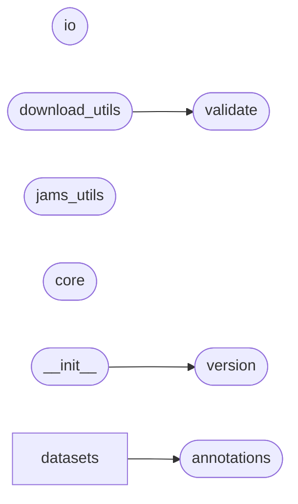

# Code Overview

[_Documentation generated by Documatic_](https://www.documatic.com)

<!---Documatic-section-Codebase Structure Python-start--->
## Codebase Structure Python

The codebase has a single-depth folder structure,
                with 49 code files in total.

<!---Documatic-block-system_architecture-start--->

<!---Documatic-block-system_architecture-end--->

# #
<!---Documatic-section-Codebase Structure Python-end--->

<!---Documatic-section-Key Objects-start--->
## Key Objects

There are exposed imports at level-0
from the source directory (mirdata)

<!---Documatic-block-mirdata-start--->

	
<code>mirdata</code> (Click to Expand!)

* `mirdata.version.version`

<!---Documatic-block-mirdata-end--->

# #
<!---Documatic-section-Key Objects-end--->

<!---Documatic-section-Important Functions-start--->
## Important Functions

<!---Documatic-block-important_funcs-start--->
<!---Documatic-block-most_used_funcs-start--->
### Most Utilised Functions

* [mirdata.datasets.rwc_classical.load_beats](5-mirdata_datasets.md#mirdata.datasets.rwc_classical.load_beats) (2 times)
* [mirdata.datasets.rwc_classical.load_sections](5-mirdata_datasets.md#mirdata.datasets.rwc_classical.load_sections) (2 times)
* [mirdata.datasets.rwc_classical.load_audio](5-mirdata_datasets.md#mirdata.datasets.rwc_classical.load_audio) (2 times)
* [mirdata.datasets.rwc_classical._duration_to_sec](5-mirdata_datasets.md#mirdata.datasets.rwc_classical._duration_to_sec) (2 times)
* [mirdata.validate.md5](3-mirdata_validate.md#mirdata.validate.md5) (1 times)
* mirdata.version.version (1 times)
<!---Documatic-block-most_used_funcs-end--->

<!---Documatic-block-end_user_funcs-start--->
### End User Exposed Functions

* mirdata.version.version
* mirdata.__init__.list_datasets
* mirdata.__init__.initialize
<!---Documatic-block-end_user_funcs-end--->
<!---Documatic-block-important_funcs-end--->

# #
<!---Documatic-section-Important Functions-end--->

<!---Documatic-section-File IO-start--->
## File IO

<!---Documatic-block-file_io-start--->
The following files have file read operations

<!---Documatic-block-mirdata-start--->

	
<code>mirdata</code> (Click to Expand!)

* mirdata.core
* mirdata.download_utils
* mirdata.io
* mirdata.jams_utils
* mirdata.validate

<!---Documatic-block-mirdata-end--->

<!---Documatic-block-mirdata.datasets-start--->

	
<code>mirdata.datasets</code> (Click to Expand!)

* mirdata.datasets.beatport_key
* mirdata.datasets.billboard
* mirdata.datasets.cante100
* mirdata.datasets.compmusic_jingju_acappella
* mirdata.datasets.compmusic_otmm_makam
* mirdata.datasets.da_tacos
* mirdata.datasets.dali
* mirdata.datasets.freesound_one_shot_percussive_sounds
* mirdata.datasets.good_sounds
* mirdata.datasets.groove_midi
* mirdata.datasets.gtzan_genre
* mirdata.datasets.guitarset
* mirdata.datasets.ikala
* mirdata.datasets.maestro
* mirdata.datasets.medley_solos_db
* mirdata.datasets.medleydb_melody
* mirdata.datasets.medleydb_pitch
* mirdata.datasets.mtg_jamendo_autotagging_moodtheme
* mirdata.datasets.orchset
* mirdata.datasets.phenicx_anechoic
* mirdata.datasets.rwc_classical
* mirdata.datasets.rwc_jazz
* mirdata.datasets.rwc_popular
* mirdata.datasets.salami
* mirdata.datasets.saraga_hindustani
* mirdata.datasets.slakh
* mirdata.datasets.tinysol
* mirdata.datasets.tonas
* mirdata.datasets.vocadito

<!---Documatic-block-mirdata.datasets-end--->

The following files have file write operations

<!---Documatic-block-mirdata-start--->

	
<code>mirdata</code> (Click to Expand!)

* mirdata.download_utils

<!---Documatic-block-mirdata-end--->

<!---Documatic-block-mirdata.datasets-start--->

	
<code>mirdata.datasets</code> (Click to Expand!)

* mirdata.datasets.beatport_key

<!---Documatic-block-mirdata.datasets-end--->
<!---Documatic-block-file_io-end--->

# #
<!---Documatic-section-File IO-end--->

<!---Documatic-section-Class Hierarchy-start--->
## Class Hierarchy

<!---Documatic-block-core.Dataset-start--->

	
<code>core.Dataset</code> (Click to Expand!)

* mirdata.datasets.beatport_key.Dataset
* mirdata.datasets.giantsteps_tempo.Dataset
* mirdata.datasets.maestro.Dataset
* mirdata.datasets.rwc_popular.Dataset
* mirdata.datasets.tonality_classicaldb.Dataset

<!---Documatic-block-core.Dataset-end--->

<!---Documatic-block-core.MultiTrack-start--->

	
<code>core.MultiTrack</code> (Click to Expand!)

* mirdata.datasets.dagstuhl_choirset.MultiTrack
* mirdata.datasets.phenicx_anechoic.MultiTrack
* mirdata.datasets.slakh.MultiTrack

<!---Documatic-block-core.MultiTrack-end--->

<!---Documatic-block-mirdata.core.Dataset-start--->

	
<code>mirdata.core.Dataset</code> (Click to Expand!)

* mirdata.datasets.acousticbrainz_genre.Dataset
* mirdata.datasets.beatles.Dataset
* mirdata.datasets.beatport_key.Dataset
* mirdata.datasets.billboard.Dataset
* mirdata.datasets.cante100.Dataset
* mirdata.datasets.compmusic_jingju_acappella.Dataset
* mirdata.datasets.compmusic_otmm_makam.Dataset
* mirdata.datasets.da_tacos.Dataset
* mirdata.datasets.dagstuhl_choirset.Dataset
* mirdata.datasets.dali.Dataset
* mirdata.datasets.freesound_one_shot_percussive_sounds.Dataset
* mirdata.datasets.giantsteps_key.Dataset
* mirdata.datasets.giantsteps_tempo.Dataset
* mirdata.datasets.good_sounds.Dataset
* mirdata.datasets.groove_midi.Dataset
* mirdata.datasets.gtzan_genre.Dataset
* mirdata.datasets.guitarset.Dataset
* mirdata.datasets.haydn_op20.Dataset
* mirdata.datasets.ikala.Dataset
* mirdata.datasets.irmas.Dataset
* mirdata.datasets.maestro.Dataset
* mirdata.datasets.medley_solos_db.Dataset
* mirdata.datasets.medleydb_melody.Dataset
* mirdata.datasets.medleydb_pitch.Dataset
* mirdata.datasets.mridangam_stroke.Dataset
* mirdata.datasets.mtg_jamendo_autotagging_moodtheme.Dataset
* mirdata.datasets.orchset.Dataset
* mirdata.datasets.phenicx_anechoic.Dataset
* mirdata.datasets.queen.Dataset
* mirdata.datasets.rwc_classical.Dataset
* mirdata.datasets.rwc_jazz.Dataset
* mirdata.datasets.rwc_popular.Dataset
* mirdata.datasets.salami.Dataset
* mirdata.datasets.saraga_carnatic.Dataset
* mirdata.datasets.saraga_hindustani.Dataset
* mirdata.datasets.slakh.Dataset
* mirdata.datasets.tinysol.Dataset
* mirdata.datasets.tonality_classicaldb.Dataset
* mirdata.datasets.tonas.Dataset
* mirdata.datasets.vocadito.Dataset

<!---Documatic-block-mirdata.core.Dataset-end--->

<!---Documatic-block-mirdata.core.MultiTrack-start--->

	
<code>mirdata.core.MultiTrack</code> (Click to Expand!)

* mirdata.datasets.dagstuhl_choirset.MultiTrack
* mirdata.datasets.phenicx_anechoic.MultiTrack
* mirdata.datasets.slakh.MultiTrack

<!---Documatic-block-mirdata.core.MultiTrack-end--->

<!---Documatic-block-mirdata.core.Track-start--->

	
<code>mirdata.core.Track</code> (Click to Expand!)

* mirdata.core.MultiTrack

<!---Documatic-block-mirdata.core.Track-end--->

<!---Documatic-block-object-start--->

	
<code>object</code> (Click to Expand!)

* mirdata.core.Dataset
* mirdata.core.Track

<!---Documatic-block-object-end--->

# #
<!---Documatic-section-Class Hierarchy-end--->

[_Documentation generated by Documatic_](https://www.documatic.com)