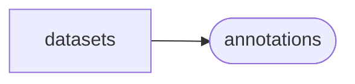

# Mirdata Datasets

[_Documentation generated by Documatic_](https://www.documatic.com)

<!---Documatic-section-Codebase Structure-start--->
## Codebase Structure

<!---Documatic-block-system_architecture-start--->

<!---Documatic-block-system_architecture-end--->

# #
<!---Documatic-section-Codebase Structure-end--->

<!---Documatic-section-mirdata.datasets.rwc_classical.load_beats-start--->
## [mirdata.datasets.rwc_classical.load_beats](5-mirdata_datasets.md#mirdata.datasets.rwc_classical.load_beats)

<!---Documatic-section-load_beats-start--->
<!---Documatic-block-mirdata.datasets.rwc_classical.load_beats-start--->
<details>
	<summary><code>mirdata.datasets.rwc_classical.load_beats</code> code snippet</summary>

```python
@io.coerce_to_string_io
def load_beats(fhandle: TextIO) -> annotations.BeatData:
    beat_times = []
    beat_positions = []
    reader = csv.reader(fhandle, delimiter='\t')
    for line in reader:
        beat_times.append(float(line[0]) / 100.0)
        beat_positions.append(int(line[2]))
    (beat_positions_in_bar, beat_times) = _position_in_bar(np.array(beat_positions), np.array(beat_times))
    return annotations.BeatData(beat_times, 's', beat_positions_in_bar.astype(int), 'bar_index')
```
</details>
<!---Documatic-block-mirdata.datasets.rwc_classical.load_beats-end--->
<!---Documatic-section-load_beats-end--->

# #
<!---Documatic-section-mirdata.datasets.rwc_classical.load_beats-end--->

<!---Documatic-section-mirdata.datasets.rwc_classical.load_sections-start--->
## [mirdata.datasets.rwc_classical.load_sections](5-mirdata_datasets.md#mirdata.datasets.rwc_classical.load_sections)

<!---Documatic-section-load_sections-start--->
<!---Documatic-block-mirdata.datasets.rwc_classical.load_sections-start--->
<details>
	<summary><code>mirdata.datasets.rwc_classical.load_sections</code> code snippet</summary>

```python
@io.coerce_to_string_io
def load_sections(fhandle: TextIO) -> Optional[annotations.SectionData]:
    begs = []
    ends = []
    secs = []
    reader = csv.reader(fhandle, delimiter='\t')
    for line in reader:
        begs.append(float(line[0]) / 100.0)
        ends.append(float(line[1]) / 100.0)
        secs.append(line[2])
    if not begs:
        return None
    return annotations.SectionData(np.array([begs, ends]).T, 's', secs, 'open')
```
</details>
<!---Documatic-block-mirdata.datasets.rwc_classical.load_sections-end--->
<!---Documatic-section-load_sections-end--->

# #
<!---Documatic-section-mirdata.datasets.rwc_classical.load_sections-end--->

<!---Documatic-section-mirdata.datasets.rwc_classical.load_audio-start--->
## [mirdata.datasets.rwc_classical.load_audio](5-mirdata_datasets.md#mirdata.datasets.rwc_classical.load_audio)

<!---Documatic-section-load_audio-start--->
<!---Documatic-block-mirdata.datasets.rwc_classical.load_audio-start--->
<details>
	<summary><code>mirdata.datasets.rwc_classical.load_audio</code> code snippet</summary>

```python
@io.coerce_to_bytes_io
def load_audio(fhandle: BinaryIO) -> Tuple[np.ndarray, float]:
    return librosa.load(fhandle, sr=None, mono=True)
```
</details>
<!---Documatic-block-mirdata.datasets.rwc_classical.load_audio-end--->
<!---Documatic-section-load_audio-end--->

# #
<!---Documatic-section-mirdata.datasets.rwc_classical.load_audio-end--->

<!---Documatic-section-mirdata.datasets.rwc_classical._duration_to_sec-start--->
## [mirdata.datasets.rwc_classical._duration_to_sec](5-mirdata_datasets.md#mirdata.datasets.rwc_classical._duration_to_sec)

<!---Documatic-section-_duration_to_sec-start--->
<!---Documatic-block-mirdata.datasets.rwc_classical._duration_to_sec-start--->
<details>
	<summary><code>mirdata.datasets.rwc_classical._duration_to_sec</code> code snippet</summary>

```python
def _duration_to_sec(duration):
    if type(duration) == str:
        if ':' in duration:
            if len(duration.split(':')) <= 2:
                (minutes, secs) = duration.split(':')
            else:
                (minutes, secs, _) = duration.split(':')
            total_secs = float(minutes) * 60 + float(secs)
            return total_secs
    else:
        raise ValueError('Expected duration to have type str, got {}'.format(type(duration)))
```
</details>
<!---Documatic-block-mirdata.datasets.rwc_classical._duration_to_sec-end--->
<!---Documatic-section-_duration_to_sec-end--->

# #
<!---Documatic-section-mirdata.datasets.rwc_classical._duration_to_sec-end--->

[_Documentation generated by Documatic_](https://www.documatic.com)